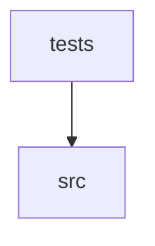

Project Semantic Graph

This file summarizes the codebase modules, classes, functions, and dependencies. It is dynamically generated to help agents locate symbols with minimal token consumption.

## Overview
- **Total indexed files**: 22
- **Files with symbols**: 16

---

## Layer Map

| Layer | Files with symbols |
|-------|--------------------|
| `src/higpertext_mcp` | 7 |
| `tests/test_annotations.py` | 1 |
| `tests/test_resources.py` | 1 |
| `tests/test_server_integration.py` | 1 |
| `tests/test_server_list_changed.py` | 1 |
| `tests/test_discovery.py` | 1 |
| `tests/test_dispatch.py` | 1 |
| `tests/test_schema.py` | 1 |
| `tests/test_external.py` | 1 |
| `tests/test_server_external_integration.py` | 1 |

---

## Entry Points

- [`src/higpertext_mcp/server.py`](file:///src/higpertext_mcp/server.py)
- [`tests/test_external.py`](file:///tests/test_external.py)
- [`tests/test_server_external_integration.py`](file:///tests/test_server_external_integration.py)

---

## Dependency Graph (Layer Level)

---

## Files & Symbols Directory

### 📁 `src/higpertext_mcp/`

### 📂 [src/higpertext_mcp/annotations.py](file:///src/higpertext_mcp/annotations.py) (PYTHON)
*Hints de seguridad/comportamiento por capability, para `Tool.annotations`.

Estático y curado a mano porque las capability JSON no declaran esta info hoy
— inferirla del texto sería frágil. `discovery.py` ahora expone todas las
capabilities que el perfil activo otorgue (no solo un set fijo curado); toda
capability sin entrada acá recibe el hint más conservador (mutating, no
idempotente) por defecto, así que ampliar estos sets es una mejora de UX, no
un requisito de seguridad.*

#### Classes
- **`class ToolHints`**

#### Functions
- `def hints_for(capability_id)`

**Imports**: `__future__.annotations`

---

### 📂 [src/higpertext_mcp/discovery.py](file:///src/higpertext_mcp/discovery.py) (PYTHON)
*Resuelve raíz de proyecto, perfil activo y capabilities permitidas.

Usa resolución basada en cwd — el mismo patrón que higpertext-cli usa para sus
hooks (`hook_utils.get_project_root`) — NO `higpertext.kernel.config_paths.PROJECT_ROOT`,
que resuelve la raíz del *motor instalado*, no la del proyecto destino. Ver
docs/architecture.md para el porqué de esta distinción.*

#### Functions
- `def resolve_project_root()` — *Raíz del proyecto destino: override explícito o cwd del proceso servidor.*
- `def _read_json(path)`
- `def active_profile(root)`
- `def profile_capability_ids(root, profile)` — *Capabilities declaradas por el perfil, vía la misma resolución de rutas del motor.

`HigpertextEngine.profiles` resuelve `src/config/profiles/` (convención de
un agente externo creado con agent-builder) con fallback al paquete
instalado — que es también donde caen los perfiles propios del motor
(`src/higpertext_data/config/profiles/`) cuando `higpertext-cli` se testea
contra sí mismo. Antes esta función asumía solo la primera ruta y
devolvía [] silenciosamente para el segundo caso.*
- `def allowed_capability_ids(root)` — *Intersección entre todas las capabilities del motor y lo que el perfil activo permite.

Fail-closed: sin perfil activo o sin perfil legible, no se expone nada.*

**Imports**: `__future__.annotations`, `higpertext.capabilities.common.scripts.core.governance.list_rules.list_all_capability_ids`, `higpertext.kernel.engine.HigpertextEngine`, `os`

---

### 📂 [src/higpertext_mcp/dispatch.py](file:///src/higpertext_mcp/dispatch.py) (PYTHON)
*Ejecuta una capability in-process, reusando el dispatcher del motor.

Da paridad real con el CLI ('htx task'): normaliza/valida parámetros, valida
el contrato técnico (`contract.rules`) y registra la ejecución en `.memory/` —
reusando las mismas funciones puras que `capability_task_service.py` del motor
(`normalize_and_validate_params`, `ContractValidator`, `save_memory`,
`build_memory_notes`). Deliberadamente NO pasa por `HigpertextHub`/`ROOT_DIR`
de `router.py`: en modo desarrollo (paquete `higpertext` resuelto por `sys.path`,
no instalado en site-packages) `ROOT_DIR` resuelve siempre al repo de
higpertext-cli sin importar el cwd del proceso — exactamente el patrón que
`discovery.py` documenta evitar para no romper el soporte multi-proyecto.

Limitación conocida (documentada, no oculta): `capabilities_runner` resuelve rutas
del proyecto (`_PROJECT_EXTERNAL_CAPS`, `_PROJECT_SOURCE_CAPS`) usando `Path.cwd()`
evaluado en el momento del import del módulo. Esto es correcto siempre que el
proceso del servidor MCP se lance una vez por proyecto con ese cwd ya fijo (el
patrón estándar de un server MCP local declarado en `.mcp.json`); NO sirve para un
server compartido entre múltiples proyectos en el mismo proceso.*

#### Classes
- **`class CapabilityResult`** — *Resultado agnóstico de transporte de una capability.

``output`` se conservaba como texto opaco porque el CLI heredó el contrato
stdin/stdout de los scripts. Los clientes agénticos no deben depender de
ese formato: reciben este sobre estable y pueden usar ``data`` sin
interpretar prefijos como ``[SUCCESS]`` o logs de consola.*
  - `def to_dict(self)`

#### Functions
- `def _params_to_argv(capability_id, params)`
- `def _result_data(output)` — *Convierte JSON emitido por una capability en datos; encapsula texto legado.

La envoltura ``text`` es una compatibilidad temporal para las capabilities
que aún imprimen texto. El protocolo MCP nunca expone ese texto como la
respuesta principal del tool.*
- `def _summary(output, ok)`
- `def _save_memory_best_effort(capability_id, params, result, contract_ok, contract_errors)`
- `def call_capability(capability_id, params, capability_data)`

**Imports**: `__future__.annotations`, `higpertext.capabilities.capabilities_runner`, `higpertext.capabilities.common.scripts.core.governance.memory_manager.save_memory`, `higpertext.kernel.infrastructure.cli.execution_result.run_inprocess`, `higpertext.kernel.infrastructure.cli.parameter_contracts.normalize_and_validate_params`, `higpertext.kernel.infrastructure.cli.task_result_reporter.build_memory_notes`, `higpertext.kernel.infrastructure.validation.contract_validator.ContractValidator`

---

### 📂 [src/higpertext_mcp/external.py](file:///src/higpertext_mcp/external.py) (PYTHON)
*Proxy hacia otros servidores MCP externos (stdio) — federación v1.

`higpertext-mcp` puede actuar simultáneamente como servidor MCP (hacia el
asistente) y como cliente MCP (hacia otros servidores declarados en
`.higpertext/config/mcp_external.json`), fusionando sus tools bajo el mismo
endpoint con el prefijo `external.<server>.<tool>`.

Alcance v1, deliberadamente acotado (ver plan): solo transporte stdio, sin
reconexión automática ni hot-add a mitad de sesión, sin `ContractValidator`
ni registro en `.memory/` para tools externas (no son capabilities propias).
Un servidor que falla al iniciar o revienta después nunca tumba el proceso
de higpertext-mcp — se omite/desaparece de `list_tools()`, siempre logueando
a stderr (nunca a stdout, rompería el protocolo stdio).*

#### Classes
- **`class ExternalServerConfig`**
- **`class ExternalServerPool`** — *Administra sesiones MCP a servidores externos y fusiona/reenvía sus tools.

`configs=[]` (default) la vuelve un no-op total, así `build_server()` sin
pool sigue comportándose exactamente igual que antes de esta feature.*
  - `def __init__(self, configs)`
  - `def from_sessions(cls, sessions)` — *Constructor de testing: inyecta sesiones ya conectadas, sin spawnear nada.*
  - `def has_tool(self, name)`
  - `def _resolve(self, name)` — *Resuelve `external.<server>.<real_name>` sin depender de un list_tools_merged() previo.

Los nombres de servidor los definimos nosotros en la config (sin
puntos garantizado en la práctica), así que partir con maxsplit=2
es seguro incluso si `real_name` trae puntos propios.*

#### Functions
- `def _warn(message)`
- `def _read_json(path)`
- `def load_external_servers(root)` — *Lee y valida `.higpertext/config/mcp_external.json`. Fail-closed: [] en cualquier error.*
- `def _prefixed_name(server_name, tool_name)`

**Imports**: `__future__.annotations`, `mcp.client.session.ClientSession`, `mcp.client.stdio.StdioServerParameters`, `mcp.client.stdio.stdio_client`, `mcp.types`

---

### 📂 [src/higpertext_mcp/resources.py](file:///src/higpertext_mcp/resources.py) (PYTHON)
*Expone telemetría real de uso (.higpertext/state/telemetry.jsonl) como MCP resource.

Es dato de solo lectura que ya existe en disco (lo escribe hook_post_observer.py
del motor) — no tiene sentido envolverlo en una tool cuando el modelo puede
leerlo pasivamente como resource, sin gastar un tool call.*

#### Functions
- `def _read_telemetry_lines(root)`
- `def summarize_usage(root)` — *Agrega tokens/costo estimado por tool a partir de la telemetría en disco.*

**Imports**: `__future__.annotations`

---

### 📂 [src/higpertext_mcp/schema.py](file:///src/higpertext_mcp/schema.py) (PYTHON)
*Traduce el JSON de definición de una capability (parameters[]) a JSON Schema MCP.

Reusa `list_rules.load_capability_meta`, ya presente en higpertext-cli, en vez de
reimplementar el escaneo de `capabilities/<namespace>/**/*.json` — esa función ya
cubre el layout inconsistente entre `common.*` (definitions/) y `git.*`/`security.*`
(json plano en la raíz del namespace).*

#### Classes
- **`class ToolSpec`**

#### Functions
- `def _infer_type(default)` — *Infiere el tipo JSON Schema a partir del default string de la capability.

Todas las capabilities declaran sus defaults como string (formato CLI), pero
el valor real que representan puede ser bool o int — ver `_parse_bool` en
grep_search.py, que acepta "True"/"true" indistintamente, así que anunciar
el tipo real acá no rompe el dispatch in-process (str(True) -> "True" sigue
siendo válido para el parser de la capability).*
- `def _build_input_schema(parameters)`
- `def _build_description(definition)`
- `def load_tool_spec(capability_id)`

**Imports**: `__future__.annotations`, `higpertext.capabilities.common.scripts.core.governance.list_rules.load_capability_meta`

---

### 📂 [src/higpertext_mcp/server.py](file:///src/higpertext_mcp/server.py) (PYTHON)
*Entrypoint del servidor MCP: registra una tool por cada capability permitida.

Usa `mcp.server.lowlevel.Server`, no `mcp.server.fastmcp.FastMCP` — FastMCP deriva
el inputSchema de los type hints de una función Python fija (`add_tool(fn, ...)`),
lo cual no sirve acá: el schema de cada tool viene de un JSON externo (`schema.py`)
resuelto en runtime, distinto por capability y por perfil activo. El API de bajo
nivel (`list_tools`/`call_tool` como handlers explícitos) es el que soporta eso.*

#### Functions
- `def _load_tools()` — *Perfil activo del proyecto ∩ set fijo de v1 → specs cargadas desde sus JSON.

Fail-closed: una capability permitida por perfil pero sin JSON legible se
omite (no crashea el server ni expone una tool rota).*
- `def _tool_annotations(capability_id)`
- `def _mcp_tool_name(capability_id)` — *Sanea un capability_id ("common.grep-search") a un nombre de tool MCP válido.

Varios clientes (VS Code entre ellos) validan `Tool.name` contra
`^[a-z0-9_-]+$` y descartan silenciosamente cualquier tool que no matchee
— un id con "." (la convención real de higpertext-cli) invalida el 100%
del catálogo. capability_id sigue siendo la clave interna para dispatch;
esto solo afecta el nombre expuesto al protocolo.*
- `def _to_mcp_tool(capability_id, spec)`
- `def build_server(pool)`
- `def run()`

**Imports**: `__future__.annotations`, `asyncio`, `higpertext_mcp.annotations`, `higpertext_mcp.discovery`, `higpertext_mcp.dispatch`, `higpertext_mcp.external`, `higpertext_mcp.resources`, `higpertext_mcp.schema`, `mcp.server.lowlevel.Server`, `mcp.server.stdio.stdio_server`, `mcp.types`

---

### 📁 `tests/`

- [`test_annotations.py`](file:///tests/test_annotations.py)
- [`test_discovery.py`](file:///tests/test_discovery.py)
- [`test_dispatch.py`](file:///tests/test_dispatch.py)
- [`test_external.py`](file:///tests/test_external.py)
- [`test_resources.py`](file:///tests/test_resources.py)
- [`test_schema.py`](file:///tests/test_schema.py)
- [`test_server_external_integration.py`](file:///tests/test_server_external_integration.py)
- [`test_server_integration.py`](file:///tests/test_server_integration.py)
- [`test_server_list_changed.py`](file:///tests/test_server_list_changed.py)

## Capabilities Index

Tabla generada desde `src/capabilities/**/*.json`. Usa estos IDs con `htx task <id>`.

| ID | Description | Hook Task | Entrypoint |
|----|-------------|-----------|------------|
| `common.agent-acceptance` | Evalúa criterios de aceptación de un agente higpertext y genera evidencia JSON p | `—` | `capabilities/common/scripts/core/agents/agent_acceptance.py` |
| `common.agent-import` | Importa un agente externo (perfil + capabilities propias) hacia el .higpertext/  | `—` | `capabilities/common/scripts/core/agents/agent_import.py` |
| `common.hook-generator` | Autogestiona la creación de hooks propios del agente (custom o por perfil), con  | `—` | `capabilities/common/scripts/core/agents/hook_generator.py` |
| `common.profile-create` | Crea un perfil nuevo desde cero en el .higpertext/ del proyecto actual — reempla | `—` | `capabilities/common/scripts/core/agents/profile_create.py` |
| `common.profile-editor` | Autogestiona ajustes a un perfil existente (capabilities, rules, system_prompt)  | `—` | `capabilities/common/scripts/core/agents/profile_editor.py` |
| `common.subagent-executor` | Lanza la ejecución aislada de un subagente especializado para resolver una subta | `—` | `capabilities/common/scripts/core/agents/subagent_executor.py` |
| `common.code-skeletonizer` | Genera una versión 'esqueleto' de un archivo de código fuente (especialmente Pyt | `—` | `capabilities/common/scripts/core/context/code_skeletonizer.py` |
| `common.context-assembler` | Ensambla un 'context pack' curado para una tarea concreta. Dado un objetivo y ti | `—` | `capabilities/common/scripts/core/context/context_assembler.py` |
| `common.context-budget-report` | Estima cuánto contexto consume una lectura, búsqueda o skeleton antes de ejecuta | `—` | `capabilities/common/scripts/core/context/context_budget_report.py` |
| `common.diff-impact-analyzer` | Dado un rango de commits (o el working tree), determina qué capabilities y qué t | `—` | `capabilities/common/scripts/core/context/diff_impact_analyzer.py` |
| `common.error-context-locator` | Extrae file:line desde trazas, errores o logs y devuelve contexto mínimo con sug | `—` | `capabilities/common/scripts/core/context/error_context_locator.py` |
| `common.skill-resolver` | Selecciona, del catálogo de skills FIJAS del motor (templates/skills/), cuáles s | `—` | `capabilities/common/scripts/core/context/skill_resolver.py` |
| `common.smart-read` | Lee archivos de forma segura para LLM. En modo auto evita volcar archivos grande | `—` | `capabilities/common/scripts/core/context/smart_read.py` |
| `common.governance-exception` | Registra o lista excepciones aprobadas a reglas de gobernanza para un perfil. | `—` | `capabilities/common/scripts/core/governance/governance_exception.py` |
| `common.list-rules` | Lista todas las capacidades disponibles para el perfil activo con su namespace,  | `hook_list_rules` | `capabilities/common/scripts/core/governance/list_rules.py` |
| `common.load-rules` | Carga las reglas detalladas de capacidades seleccionadas al contexto del LLM act | `hook_load_rules` | `capabilities/common/scripts/core/governance/load_rules.py` |
| `common.memory-manager` | Persiste aprendizajes y estados después de cada acción del agente. | `—` | `capabilities/common/scripts/core/governance/memory_manager.py` |
| `common.truth-keeper` | Lee, escribe y gestiona el contexto de la Fuente de Verdad en .memory/truth.json | `—` | `src/higpertext/capabilities/common/scripts/core/governance/truth_keeper.py` |
| `common.quality-resolver` | Actualiza el checklist de remediación a partir de un reporte de calidad. | `—` | `capabilities/common/scripts/core/quality_resolver.py` |
| `common.commit-report` | Genera un reporte explicativo de un commit o rango de commits: resumen en lengua | `—` | `capabilities/common/scripts/core/reports/commit_report.py` |
| `common.efficiency-meter` | Mide la eficiencia de una sesión de agente cruzando telemetry.jsonl con los cont | `—` | `capabilities/common/scripts/core/reports/efficiency_meter.py` |
| `common.investigation-report` | Persiste un informe de investigación o de justificación técnica de contenido lib | `—` | `capabilities/common/scripts/core/reports/investigation_report.py` |
| `common.report-viewer` | Muestra en terminal los reportes persistidos e indexados por higpertext. | `—` | `capabilities/common/scripts/core/reports/report_viewer.py` |
| `common.roadmap-phase-close` | Único camino gobernado para marcar una fase de un roadmap como done. Ejecuta un  | `—` | `capabilities/common/scripts/core/reports/roadmap_phase_close.py` |
| `common.roadmap-report` | Genera un reporte explicativo del roadmap activo: progreso por fase, skills y su | `—` | `capabilities/common/scripts/core/reports/roadmap_report.py` |
| `common.telemetry-report` | Muestra dashboard de telemetría higpertext en terminal: tokens estimados, costo, | `—` | `capabilities/common/scripts/core/reports/telemetry_report.py` |
| `common.training-recommender` | Analiza la telemetría higpertext y sugiere acciones de entrenamiento del agente: | `—` | `capabilities/common/scripts/core/reports/training_recommender.py` |
| `common.graph-query` | Consulta el grafo semántico para encontrar símbolos relacionados con un nombre o | `—` | `capabilities/common/scripts/core/search/graph_query.py` |
| `common.graph-rebuild` | Regenera el grafo semántico del proyecto parseando todos los archivos Python con | `—` | `capabilities/common/scripts/core/search/graph_rebuild.py` |
| `common.grep-search` | Busca un patrón literal o regex en el código/texto del proyecto (y opcionalmente | `hook_grep_search` | `capabilities/common/scripts/core/search/grep_search.py` |
| `common.rag-index` | Indexa el código fuente y documentación del proyecto para habilitar la búsqueda  | `—` | `capabilities/common/scripts/core/search/rag_index.py` |
| `common.search-router` | Recomienda el plan de capacidades adecuado para localizar contexto: error-contex | `—` | `capabilities/common/scripts/core/search/search_router.py` |
| `common.semantic-diff` | Detecta qué funciones, clases y métodos cambiaron entre dos commits (o entre HEA | `—` | `capabilities/common/scripts/core/search/semantic_diff.py` |
| `common.semantic-search` | Busca fragmentos de código y documentación semánticamente usando RAG. | `—` | `capabilities/common/scripts/core/search/semantic_search.py` |
| `common.doctor` | Diagnóstico estructural y amplio del workspace: launcher, entorno, capabilities, | `—` | `capabilities/common/scripts/core/session/doctor.py` |
| `common.hook-health` | Prueba de COMPORTAMIENTO (no solo registro) de la cadena de hooks de reducción d | `—` | `capabilities/common/scripts/core/session/hook_health.py` |
| `common.hook-sync-check` | Compara los hooks desplegados en asistentes contra la fuente canónica del motor. | `—` | `capabilities/common/scripts/core/session/hook_sync_check.py` |
| `common.hooks-manager` | Gestiona el ciclo de vida de hooks nativos de higpertext: listar, agregar, habil | `—` | `capabilities/common/scripts/core/session/hooks_manager.py` |
| `common.session-clean` | Cierra la sesión de desarrollo y desmonta/borra todos los recursos efímeros del  | `hook_session_stop` | `capabilities/common/scripts/core/session/session_control.py` |
| `common.session-start` | Bootstraps a temporal development session by mounting required skills, subagents | `hook_session_start` | `capabilities/common/scripts/core/session/session_control.py` |
| `common.dep-manager` | Gestiona dependencias del proyecto: instala, desinstala y lista paquetes usando  | `—` | `capabilities/common/scripts/core/system/dep_manager.py` |
| `common.eval-agent` | Ejecuta el framework de evaluación de modelos y configuración del higpertext Eng | `—` | `capabilities/common/scripts/core/system/eval_agent.py` |
| `common.higpertext-tester` | Suite de validación y testing para asegurar la integridad de capacidades y el cu | `—` | `capabilities/common/scripts/core/system/higpertext_tester.py` |
| `common.llm-invoke` | Invoca un modelo LLM por API (Anthropic, OpenAI, Gemini, Ollama). Soporta comple | `—` | `capabilities/common/scripts/core/system/llm_invoke.py` |
| `common.project-explainer` | Analiza la estructura del proyecto y genera de forma automática y auto-increment | `hook_project_explainer` | `capabilities/common/scripts/core/system/project_explainer.py` |
| `common.task-decomposer` | Descompone un objetivo de ingeniería en un task-graph determinístico (DAG). Prod | `—` | `capabilities/common/scripts/core/system/task_decomposer.py` |
| `git.committer` | Realiza un commit en Git siguiendo el estándar Conventional Commits y opcionalme | `hook_higpertext_enforcer` | `capabilities/git/scripts/commit_changes.py` |
| `git.diff` | Detecta cambios locales en el repositorio Git (archivos modificados, eliminados, | `hook_git_diff` | `capabilities/git/scripts/git_diff.py` |
| `git.ls-files` | Lista e inspecciona archivos trackeados por git como alternativa segura a ls/fin | `—` | `capabilities/git/scripts/git_ls_files.py` |
| `git.worktree` | Gestiona git worktrees (listar, crear, eliminar y limpiar) para que los agentes  | `—` | `capabilities/git/scripts/git_worktree.py` |
| `security.k8s-auditor` | Audita archivos YAML de Kubernetes buscando fallos de seguridad o malas práctica | `—` | `capabilities/security/scripts/k8s_auditor.py` |
| `security.secret-scanner` | Escanea el código fuente e historial en busca de claves API expuestas, PATs, tok | `—` | `capabilities/security/scripts/secret_scanner.py` |
| `security.secret-set` | Guarda, elimina o consulta el estado de la API key de un provider LLM en el llav | `—` | `capabilities/security/scripts/secret_manager.py` |

---

## Profiles Index

Perfiles disponibles con sus capabilities habilitadas y hooks que activan.

### `agent_designer`
*Agent Designer — diseña, adapta y audita perfiles, capabilities y contratos técnicos del higpertext Engine dentro de este proyecto (un único .higpertext/, sin scaffolding de agentes externos separados).*

**Capabilities** (31): `common.agent-acceptance`, `common.profile-create`, `common.profile-editor`, `common.hook-generator`, `common.agent-import`, `common.skill-resolver`, `common.grep-search`, `common.smart-read`, `common.list-rules`, `common.load-rules`, `common.memory-manager`, `common.truth-keeper`, `common.session-start`, `common.session-clean`, `common.hook-health`, `common.context-budget-report`, `common.eval-agent`, `common.subagent-executor`, `common.error-context-locator`, `common.search-router`, `common.project-explainer`, `git.ls-files`, `common.task-decomposer`, `common.code-skeletonizer`, `security.secret-scanner`, `git.committer`, `common.diff-impact-analyzer`, `common.quality-resolver`, `security.k8s-auditor`, `common.doctor`, `common.hook-sync-check`

**Hooks activos**: `hook_grep_search`, `hook_higpertext_enforcer`, `hook_list_rules`, `hook_load_rules`, `hook_project_explainer`, `hook_session_start`, `hook_session_stop`

### `base_agent`
*Perfil base incluido en todo agente higpertext. Provee contexto de configuración, hooks esenciales y el subperfil agent_designer para gobernar perfiles y capabilities del proyecto.*

**Capabilities** (7): `common.grep-search`, `common.list-rules`, `common.load-rules`, `common.memory-manager`, `common.truth-keeper`, `common.session-start`, `common.session-clean`

**Hooks activos**: `hook_grep_search`, `hook_list_rules`, `hook_load_rules`, `hook_session_start`, `hook_session_stop`

### `base_auditor`
*Perfil base de auditoría con foco en cumplimiento de gobernanza, seguridad, inspección de calidad y cobertura de código.*

**Capabilities** (2): `security.secret-scanner`, `git.diff`

**Hooks activos**: `hook_git_diff`

### `base_developer`
*Perfil base de desarrollo con foco en la escritura de código, Clean Code y TDD.*

**Capabilities** (7): `git.committer`, `git.diff`, `git.worktree`, `common.higpertext-tester`, `common.quality-resolver`, `common.code-skeletonizer`, `common.eval-agent`

**Hooks activos**: `hook_git_diff`, `hook_higpertext_enforcer`

### `base_operator`
*Perfil base de operaciones con foco en monitoreo, diagnóstico de clusters, postmortems y aplicación de parches/hotfixes.*

**Capabilities** (3): `git.diff`, `git.committer`, `common.code-skeletonizer`

**Hooks activos**: `hook_git_diff`, `hook_higpertext_enforcer`

### `global`
*Capacidades globales transversales accesibles universalmente por cualquier usuario o perfil de higpertext en todo momento.*

**Capabilities** (15): `common.memory-manager`, `common.truth-keeper`, `common.subagent-executor`, `common.session-start`, `common.session-clean`, `common.grep-search`, `common.smart-read`, `common.error-context-locator`, `common.search-router`, `common.context-budget-report`, `common.hook-health`, `common.list-rules`, `common.load-rules`, `common.project-explainer`, `common.investigation-report`

**Hooks activos**: `hook_grep_search`, `hook_list_rules`, `hook_load_rules`, `hook_project_explainer`, `hook_session_start`, `hook_session_stop`

---
